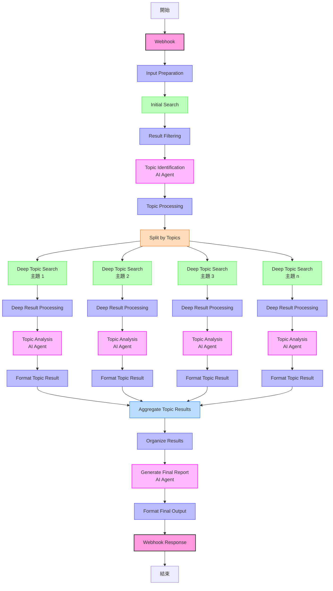

# 工作流程圖

下面是 Company News Intelligence Workflow 的完整流程圖，展示了各節點之間的關係和數據流向。



## 工作流階段說明

工作流分為五個主要階段：

### 1. 輸入處理

```
Webhook → Input Preparation
```

這個階段接收 HTTP 請求，驗證和處理輸入參數，準備後續搜索。

### 2. 初步搜索

```
Initial Search → Result Filtering
```

執行初步的網絡搜索，並對結果進行過濾和評分，確保只保留相關性高的內容。

### 3. 主題識別

```
Topic Identification → Topic Processing
```

使用 AI 分析搜索結果，識別出關鍵的營運主題，並處理這些主題以準備深度研究。

### 4. 深度研究

```
Split by Topics → Deep Topic Search → Deep Result Processing → Topic Analysis → Format Topic Result
```

這個階段將工作流分割為多個平行分支，每個分支專注於一個特定主題的深入研究。對每個主題：
1. 執行專門的深度搜索
2. 處理和過濾這些深度搜索結果
3. 使用 AI 分析提取營運洞見
4. 格式化分析結果

### 5. 情報整合

```
Aggregate Topic Results → Organize Results → Generate Final Report → Format Final Output → Webhook Response
```

這個階段將所有主題的研究結果合併起來，進行整體分析，生成綜合報告，並返回給客戶端。

## 節點類型說明

工作流使用以下類型的節點：

- **Webhook 節點** (紫紅色): 處理 HTTP 請求和響應
- **Function 節點** (藍色): 執行 JavaScript 代碼進行數據處理
- **HTTP Request 節點** (綠色): 調用外部 API 進行搜索
- **AI 節點** (紫色): 使用 OpenAI 進行複雜分析和決策
- **Split/Merge 節點** (橙/淺藍色): 處理工作流的分流和合流

## 混合架構說明

工作流採用混合架構，結合線性處理和 AI 決策：

- **線性確定性流程** (藍色和綠色節點): 用於數據處理、過濾、格式化等確定性任務
- **AI 決策流程** (紫色節點): 用於需要複雜決策和分析的任務

這種混合架構確保了工作流的高效性和靈活性，適用於複雜的情報分析任務。